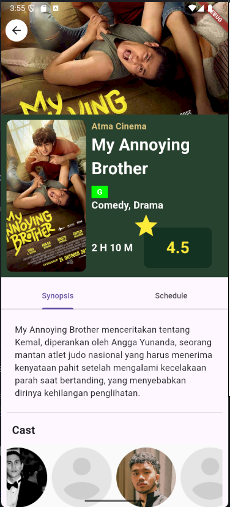

# Atma Cinema

Developed a Flutter-based mobile application for Atma Cinema, providing a seamless and user-friendly ticket booking experience. The app supports API integration for real-time data synchronization and includes text-to-speech functionality to enhance accessibility, allowing users to interact with key features effortlessly.

### Group Member : 
<ul>
    <li>Edwardy (220711676)</li>
    <li>Jesslyn Azaria Putri Lingga (220711932)</li>
    <li>Kalvin Lawinata (220711659)</li>
    <li>Natania Regina Clarabella Serafina (220711686)</li>
    <li>Febry Simahan (220711876)</li>
</ul>

### User Interface
<table>
<tr>
    <td> </td>
    <td> </td>
</tr>
</table>

